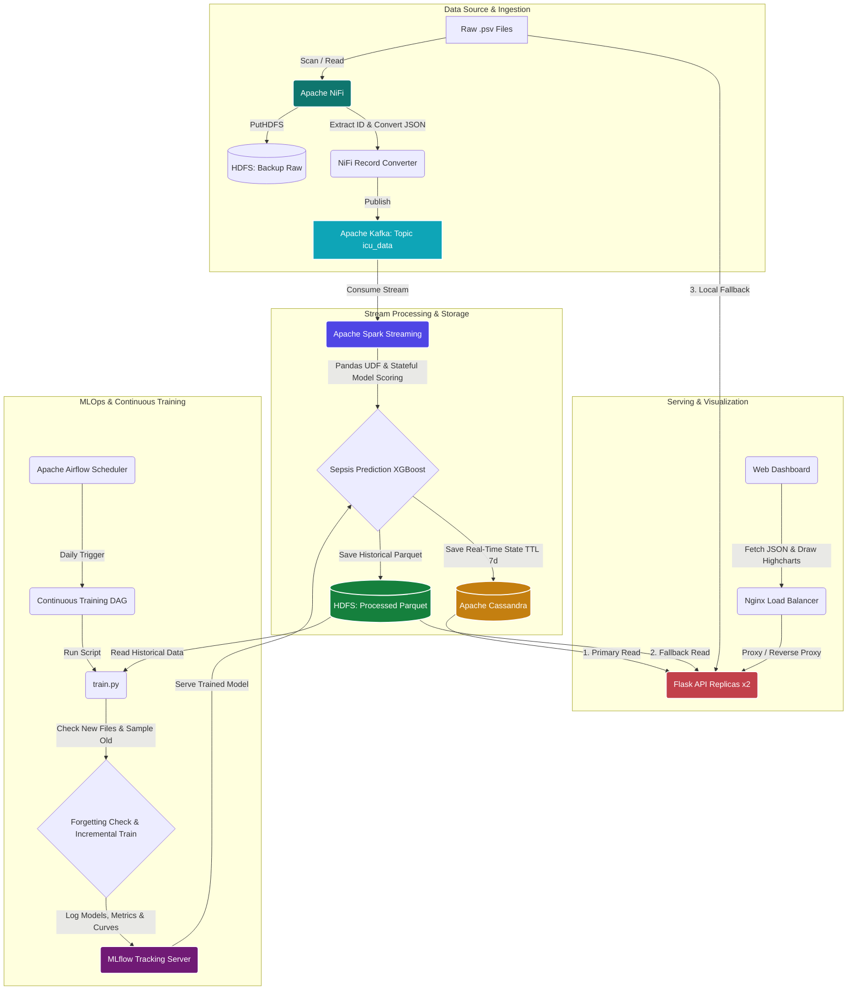

# Sepsis Monitoring - Big Data & MLOps Pipeline

Hệ thống phân tích, giám sát thời gian thực và cảnh báo sớm bệnh nhân nhiễm khuẩn huyết (Sepsis) trong phòng hồi sức tích cực (ICU) sử dụng các công nghệ Big Data hiện đại kết hợp với quy trình MLOps tự động. 

Hệ thống giả lập luồng dữ liệu y tế trực tuyến từ các thiết bị đo đạc ICU, thực hiện tính toán đặc trưng dạng chuỗi thời gian, chấm điểm bằng mô hình XGBoost trực tiếp trên luồng streaming và trực quan hóa kết quả cho đội ngũ y bác sĩ theo thời gian thực.

---

## 🏗 Sơ đồ Kiến trúc Hệ thống (System Architecture)

Hệ thống được thiết kế theo kiến trúc Lambda/Kappa cải tiến tích hợp vòng lặp phản hồi MLOps, bao gồm hai nhánh xử lý dữ liệu song song (Dual-Pipeline): **Real-time Pipeline** phục vụ giám sát tức thời và **Historical & MLOps Pipeline** phục vụ lưu trữ lâu dài và huấn luyện lại mô hình.



### 1. Ingestion Layer (Thu thập dữ liệu): Apache NiFi
- Quét các tệp dữ liệu lâm sàng thô (`.psv`) đại diện cho các bệnh nhân tại khoa ICU.
- **Backup raw:** Sao lưu toàn bộ tệp thô vào HDFS phục vụ kiểm toán dữ liệu.
- **Streaming conversion:** Trích xuất mã bệnh nhân (`patient_id`) từ tên tệp, chuyển đổi dữ liệu dạng bảng phân tách bằng dấu gạch đứng `|` sang định dạng JSON Lines, sau đó đẩy trực tiếp vào Kafka broker.

### 2. Message Broker (Đệm dữ liệu): Apache Kafka & Zookeeper
- Lưu trữ luồng dữ liệu thời gian thực trong topic `icu_data` với 3 partitions để đảm bảo khả năng mở rộng (scalability) và dung sai lỗi (fault tolerance).

### 3. Processing Layer (Xử lý luồng): Apache Spark (Structured Streaming)
- Sử dụng cơ chế stateful streaming (`applyInPandasWithState`) để quản lý trạng thái của từng bệnh nhân qua thời gian.
- Thực hiện làm sạch dữ liệu, điền giá trị khuyết (Imputation) bằng phương pháp forward-fill kết hợp mean-fill động từ scaler parameters.
- Áp dụng mô hình Machine Learning **XGBoost** qua Pandas UDF để tính toán đặc trưng cửa sổ trượt (sliding window size = 6 giờ) và dự đoán xác suất Sepsis thời gian thực.
- **Dual-write:** Ghi kết quả đồng thời vào Cassandra (để truy vấn nhanh) và HDFS Parquet (để lưu trữ lịch sử lâu dài).

### 4. Storage Layer (Lưu trữ): Cassandra & HDFS
- **Apache Cassandra (NoSQL):** Lưu trữ dữ liệu chuỗi thời gian (time-series) của bệnh nhân với tốc độ ghi cực cao. Đặt vòng đời dữ liệu **TTL = 7 ngày** (`default_time_to_live = 604800`) nhằm tiết kiệm tài nguyên bộ nhớ cho các ca bệnh hiện tại.
- **Hadoop HDFS:** Lưu trữ dữ liệu dự đoán lịch sử dưới định dạng Parquet được phân vùng (partitioned) theo `patient_id` phục vụ việc truy xuất quá khứ và làm đầu vào cho quy trình huấn luyện lại mô hình.

### 5. Serving Layer (Cung cấp API): Flask API & Nginx
- Hệ thống chạy **2 replica Flask API** để phân chia tải trọng truy vấn.
- **Nginx** đóng vai trò Load Balancer ở cổng `5000`, phân phối các yêu cầu từ Client đến các bản sao Flask API một cách mượt mà.
- **Cơ chế Fallback Query thông minh:**
  1. Đầu tiên, API truy vấn dữ liệu từ **Cassandra** (Tối ưu cho dữ liệu thời gian thực dưới 7 ngày).
  2. Nếu không tìm thấy (Cassandra TTL đã xóa dữ liệu), API tự động chuyển hướng đọc các tệp Parquet lịch sử từ **HDFS**.
  3. Nếu HDFS không khả dụng hoặc chưa có dữ liệu xử lý, API sẽ tự động đọc trực tiếp từ tệp thô `.psv` tại thư mục dữ liệu cục bộ để đảm bảo giao diện luôn hiển thị biểu đồ giả lập.

### 6. Visualization (Trực quan hóa): Web Dashboard
- Giao diện xây dựng trên nền tảng HTML5 thuần, tích hợp thư viện biểu đồ Highcharts chuyên nghiệp.
- Cho phép tìm kiếm mã bệnh nhân, hiển thị biểu đồ nhịp tim, nồng độ oxy huyết, huyết áp, nhiệt độ... cùng biểu đồ cảnh báo xác suất Sepsis động theo từng giờ ICU trôi qua.

### 7. MLOps & Continuous Training Layer (Quản trị mô hình & Tái huấn luyện): Airflow & MLflow
- **Apache Airflow:** Quản lý lịch trình huấn luyện lại mô hình hàng ngày (DAG `sepsis_continuous_training`). Tự động quét và phát hiện các dữ liệu mới trong ngày. Nếu lượng dữ liệu mới vượt quá ngưỡng cấu hình, hệ thống sẽ kích hoạt script `train.py`.
- **Chống Overfitting và Quên kiến thức cũ (Catastrophic Forgetting):** 
  - Trong quá trình học liên tục (Continuous Training), script huấn luyện sẽ lấy danh sách các file dữ liệu đã dùng trước đó từ MLflow, thực hiện **lấy mẫu ngẫu nhiên (Sampling)** một tỷ lệ dữ liệu cũ và gộp chung với dữ liệu mới để huấn luyện gia tăng (Incremental training với giá trị `learning_rate` nhỏ).
  - Đánh giá chất lượng mô hình trên tập kiểm thử toàn cục. Nếu chỉ số **AUCPR** (Area Under the Precision-Recall Curve) bị sụt giảm quá **1%** so với phiên bản trước đó, mô hình mới sẽ bị **từ chối** nhằm bảo vệ hệ thống khỏi hiện tượng catastrophic forgetting.
- **MLflow Tracking Server:** Quản lý vòng đời mô hình, lưu vết tham số huấn luyện, lưu trữ artifact (ROC curve, Utility curve, scaler parameters, model file).

---

## 📁 Cấu trúc Thư mục Dự án (Directory Structure)

```text
BIGDATA_FINAL/
├── .env                          # Tệp cấu hình biến môi trường
├── .env.example                  # Tệp cấu hình mẫu
├── docker-compose.yml            # File cấu hình cụm container Docker
├── init-hdfs.sh                  # Script khởi tạo thư mục lưu trữ HDFS
├── README.md                     # Tài liệu hướng dẫn hệ thống (Tệp này)
├── airflow/                      # Chứa DAG cấu hình cho Airflow
│   └── dags/
│       └── sepsis_training_dag.py
├── api/                          # Backend Flask API
│   ├── app.py                    # Logic API & cơ chế Fallback Query
│   ├── Dockerfile
│   ├── requirements.txt
│   └── templates/
│       └── dashboard.html        # Giao diện Web Dashboard Highcharts
├── cassandra/                    # Script khởi tạo cơ sở dữ liệu Cassandra
│   └── init.cql                  # Định nghĩa Keyspace, Table và TTL
├── data/                         # Thư mục chứa dữ liệu lâm sàng
│   ├── Data-Set-A/               # Tập dữ liệu A thô (.psv)
│   ├── Data-Set-B/               # Tập dữ liệu B thô (.psv)
│   └── active/                   # Thư mục NiFi sẽ quét để đẩy dữ liệu
├── mlops/                        # Quy trình huấn luyện và quản lý mô hình
│   ├── Dockerfile.airflow
│   ├── requirements.txt
│   └── train.py                  # Script huấn luyện XGBoost và chống quên kiến thức
├── nginx/                        # Cấu hình máy chủ cân bằng tải Nginx
│   └── nginx.conf
├── scripts/                      # Các script tiện ích bổ trợ
│   └── prepare_demo_data.py      # Script chuẩn bị dữ liệu mẫu chạy demo
└── spark/                        # Chương trình Spark Structured Streaming
    ├── app/
    │   ├── models/               # Nơi lưu trữ mô hình và scaler dự phòng offline
    │   ├── spark_stream.py       # Code xử lý luồng & Pandas UDF dự đoán Sepsis
    │   └── requirements.txt
    └── Dockerfile
```

---

## 🛠 Hướng dẫn Cài đặt & Khởi chạy (Getting Started)

### 1. Yêu cầu Hệ thống
- **Docker** & **Docker Compose V2** cài đặt sẵn trên máy.
- **Tài nguyên phần cứng khuyến nghị:** Tối thiểu **8GB RAM** (Khuyến nghị **16GB RAM**) và ít nhất **4 CPU Cores** để chạy trơn tru cụm 18 container của hệ thống Big Data.

### 2. Cấu hình biến môi trường
Trước khi chạy, hãy kiểm tra tệp `.env` tại thư mục gốc của dự án. File này cấu hình hành vi của NiFi và API:
```ini
# Mã bệnh nhân mặc định hiển thị trên Dashboard khi mở lần đầu
PATIENT_ID=p000001

# Chế độ chạy Demo:
# - USE_X_PATIENTS=true: NiFi sẽ đẩy lượng lớn dữ liệu (X_PATIENTS) vào để test tải.
# - USE_X_PATIENTS=false: Chỉ sử dụng các bệnh nhân mẫu cấu hình trong DEMO_PATIENT_IDS.
USE_X_PATIENTS=false
X_PATIENTS=100
MAX_PATIENTS=10
DEMO_PATIENT_IDS=p000001,p000003,p000007,p000009,p000011,p000018,p000028,p000042
```

### 3. Khởi chạy hệ thống bằng Docker Compose
Mở terminal tại thư mục gốc của dự án và chạy:
```bash
docker compose up -d --build
```
Lệnh này sẽ tiến hành build các Docker Image tự tạo (Spark, NiFi-setup, API, Airflow) và tải xuống các Image cần thiết từ Docker Hub. Quá trình chạy lần đầu có thể mất từ 3-7 phút tùy thuộc tốc độ mạng và phần cứng của bạn.

Sau khi khởi chạy, đợi khoảng 1 phút để các container hoàn tất việc cài đặt môi trường. Kiểm tra trạng thái bằng lệnh:
```bash
docker compose ps
```
Đảm bảo rằng các dịch vụ cấu hình một lần (`cassandra-init`, `kafka-init`, `nifi-setup`, `airflow-init`, `hdfs-init`) báo trạng thái `Exited (0)` (setup thành công) và các container dịch vụ chính đều hiển thị trạng thái `Up` hoặc `Healthy`.

---

## 📊 Hướng dẫn Sử dụng & Theo dõi các Dashboard

Khi toàn bộ hệ thống đã hoạt động, bạn có thể truy cập các đường dẫn sau từ trình duyệt web cục bộ:

| Dịch vụ / Dashboard | Đường dẫn truy cập | Tài khoản đăng nhập | Chức năng |
| :--- | :--- | :--- | :--- |
| **Sepsis Web Dashboard** | [http://localhost:5000/dashboard](http://localhost:5000/dashboard) | *Không yêu cầu* | Giao diện theo dõi chỉ số sinh tồn của bệnh nhân và cảnh báo Sepsis thời gian thực. |
| **Apache NiFi UI** | [https://localhost:8443/nifi](https://localhost:8443/nifi) | `admin` / `adminpassword123` | Theo dõi pipeline thu thập dữ liệu và chuyển đổi từ PSV sang JSON đẩy vào Kafka. *(Bỏ qua cảnh báo bảo mật SSL tự ký)* |
| **MLflow Tracking UI** | [http://localhost:5001](http://localhost:5001) | *Không yêu cầu* | Theo dõi các phiên huấn luyện mô hình, xem ROC Curve, Utility Curve và Model Registry. |
| **Apache Airflow UI** | [http://localhost:8080](http://localhost:8080) | `admin` / `admin` | Quản lý lịch trình huấn luyện tự động (Continuous Training DAG). |
| **Spark Master UI** | [http://localhost:4040](http://localhost:4040) | *Không yêu cầu* | Theo dõi hiệu năng xử lý luồng, thông lượng (throughput) và độ trễ (latency) của Spark. |

### Các bước mô phỏng chạy Real-time Demo trên Dashboard:
1. Truy cập vào giao diện **Sepsis Web Dashboard** (`http://localhost:5000/dashboard`).
2. Nhập mã bệnh nhân muốn kiểm tra tại ô **Patient ID** (hoặc nhấn chọn nhanh các bệnh nhân mẫu ở thanh danh sách bệnh nhân bên dưới, ví dụ: `p000001`).
3. Nhấn nút **Apply** để hệ thống tải dữ liệu hiện có trong database hiển thị lên biểu đồ tĩnh.
4. Nhấn nút **▶ Demo Real-time** để kích hoạt chế độ chạy giả lập. Hệ thống sẽ tự động vẽ thêm các điểm dữ liệu mới theo từng giờ lâm sàng trôi qua, mô phỏng quá trình đo đạc thực tế của máy theo dõi bệnh nhân ICU.
5. Cột **Sepsis Alert** bên tay phải hiển thị 3 trạng thái cảnh báo phân loại rõ ràng:
   - 🟢 **Normal (Bình thường):** Xác suất Sepsis dưới ngưỡng, bệnh nhân an toàn.
   - 🟡 **Sepsis Warning (Cảnh báo sớm):** Bắt đầu phát hiện dấu hiệu bất thường, xác suất vượt ngưỡng dự đoán.
   - 🔴 **Sepsis Confirmed (Cảnh báo nguy cơ cao):** Trạng thái nguy hiểm đã kéo dài liên tục, yêu cầu bác sĩ can thiệp khẩn cấp.

---

## 🛑 Dừng & Reset Hệ thống

Để dừng tạm thời hệ thống mà không làm mất dữ liệu lưu trữ (khi bật lại sẽ tiếp tục xử lý tiếp các hàng đợi):
```bash
docker compose stop
```

Để dừng hệ thống và **xóa sạch** toàn bộ tài nguyên (container, network, volume lưu trữ của Cassandra, Postgres và checkpoints HDFS):
```bash
docker compose down -v
```
> [!WARNING]
> Việc sử dụng tùy chọn `-v` sẽ xóa sạch dữ liệu trong Cassandra và HDFS. Ở lần chạy kế tiếp, NiFi sẽ quét lại dữ liệu từ tệp đầu tiên và Spark sẽ xử lý lại luồng dữ liệu như ban đầu.

---

## 📌 Các tính năng đặc biệt & Lưu ý kỹ thuật

- **Cơ chế chống quên kiến thức cũ trong Continuous Training:** 
  Khi Airflow kích hoạt việc huấn luyện lại mô hình qua `train.py`, hệ thống không chỉ học trên dữ liệu mới mà luôn lấy mẫu ngẫu nhiên 20% dữ liệu cũ (tỷ lệ điều chỉnh qua tham số `--sampling-ratio` trong DAG) để cùng tối ưu hóa hàm mất mát. Đồng thời, mô hình mới chỉ được cập nhật lên MLflow nếu hiệu năng AUCPR không bị sụt giảm. Điều này giúp ngăn ngừa hiện tượng trôi dạt mô hình (Model Drift) và Catastrophic Forgetting.
- **Tính toán State-aware Windows trong Spark:**
  Để dự đoán Sepsis chính xác, mô hình XGBoost yêu cầu thông tin lịch sử của 6 giờ gần nhất. Spark Structured Streaming duy trì một bộ nhớ trạng thái trung gian (State) cho từng bệnh nhân để lưu trữ 6 bản ghi lâm sàng gần nhất. Ngay cả khi dữ liệu truyền qua Kafka theo từng dòng lẻ tẻ, Spark vẫn đảm bảo ghép nối đủ cửa sổ 6 giờ để đưa vào mô hình dự đoán mà không bị thất thoát thông tin.
